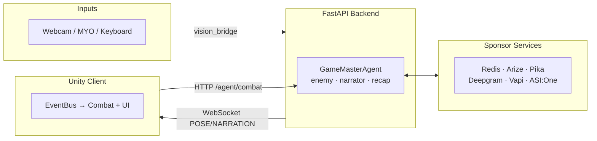

# Vision Arena

A real-time 2.5D anime boss fight controlled by **computer-vision hand gestures**, a
**MYO EMG armband**, and a swarm of **AI agents** — built for the Fetch.ai / ASI:One
hackathon. Open your palm to move, close your fist to punch (longer windup = heavier
hit), and an adaptive boss learns to counter you between exchanges.

**Live agent (ASI:One):** https://asi1.ai/chat/a8e8512f-aac3-40ee-949b-4b7dbf310f3e
**Agentverse address:** `agent1q0x73mhcy54lj0efh3eus5zxxqgkjkzascm8syy222c2ypx2zzkmy0gtez6`

## Highlights

- **Embodied control** — MediaPipe webcam gestures and a MYO armband drive movement
  and punch tiers, with a seamless keyboard fallback.
- **Adaptive boss** — every hit is traced (Arize) and stored as a 5-dim style vector
  in Redis; a KNN query recalls the most similar past player and reuses the strategy
  that beat them.
- **Agent-run match** — a `GameMasterAgent` orchestrates enemy, narrator, and recap
  agents, demoable through ASI:One via Fetch.ai Agentverse.
- **Pre-fight boss call** — the boss phones the player (Vapi) to taunt them before
  the match.
- **Post-fight recap** — Pika generates a cinematic boxing-style recap from real
  match telemetry; Deepgram voices live commentary.

## Architecture

A Unity client and a FastAPI backend talk over a WebSocket (real-time events) and
HTTP (agent decisions). A single `KiForgeArenaBootstrap` builds the whole arena at
runtime. **See [`docs/architecture.md`](docs/architecture.md) for the full diagram
and data flows.**



## Project layout

| Path | Responsibility |
| --- | --- |
| `Assets/Scripts/Bootstrap` | `KiForgeArenaBootstrap` — runtime wiring of the entire arena |
| `Assets/Scripts/Input` | CV aim, MYO charge tiers, keyboard fallback, WebSocket sources |
| `Assets/Scripts/Combat` | Punch tiers, health, guard timing, boss agent link, strategy weights |
| `Assets/Scripts/UI` | HUD, charge/health bars, narration, captions, Redis & Fight Lab panels, boss-call, recap |
| `Assets/Scripts/Telemetry` | Match event recorder, Arize-style coach feedback, mock agent client |
| `Assets/Scripts/Effects` `/Scene` `/Animation` | Charge aura, impact FX, camera, fighter animation |
| `backend/` | FastAPI WebSocket service, agent workflow, Redis wrapper, Arize tracing, Pika recap, Vapi/Deepgram adapters |

## Run the Unity demo

1. Open this folder in **Unity 2022.3** or newer.
2. Open `Assets/Scenes/VisionArena.unity` (it contains a `KiForgeArenaBootstrap`
   GameObject that builds everything at runtime).
3. Press **Play**. A phone-number entry screen appears first (the boss call — press
   **skip** to go straight to the arena), then the fight loads.

The scene is fully playable **without the backend** — gestures and agents simply
fall back to keyboard + deterministic local behavior.

### Controls (keyboard fallback)

| Input | Action |
| --- | --- |
| `A` / `D` | Move left / right |
| `J` / `K` | Left / right punch |
| `U` / `I` | Heavy / very-heavy punch |
| `;` / `'` | Hold to guard left / right |
| `B` | Hold to charge a punch (simulates MYO fist contraction) |
| `R` | Toggle the Redis sponsor panel |
| `Tab` | Toggle the AI Fight Lab panel |

When CV is connected: **open palm → walk forward**, **closed fist → punch** (longer
contraction = heavier tier).

## Run the backend

```bash
python3 -m venv .venv
source .venv/bin/activate
pip install -r backend/requirements.txt
uvicorn backend.main:app --reload --port 8000
```

- Health check: `http://127.0.0.1:8000/health`
- Unity/backend event socket: `ws://127.0.0.1:8000/ws/unity`
- See [`backend/README.md`](backend/README.md) for the full endpoint list, Redis
  schema, and Agentverse/ASI:One setup.

### Configuration (`.env`)

Everything runs in mock mode with no keys. Set only what you want to light up — the
backend loads `.env` at startup via `python-dotenv`, so **restart it after edits**.

| Variable(s) | Enables |
| --- | --- |
| `REDIS_URL` | Persistent player memory + vector recall (Redis Stack; in-memory fallback otherwise) |
| `ARIZE_API_KEY`, `ARIZE_SPACE_ID` | Arize fight-trace export (local Fight Lab works without it) |
| `ASI_ONE_API_KEY` / `OPENAI_API_KEY` (+ `ASI_ONE_BASE_URL`, `ASI_ONE_MODEL`) | Live LLM agents (deterministic fallback otherwise) |
| `FETCH_AI_AGENT_SEED`, `AGENT_PORT` | Stable Fetch.ai Agentverse address for `backend/uagents_app.py` |
| `PIKA_API_KEY`, `PIKA_RECAP_QUEUE` | Pika recap-video generation |
| `DEEPGRAM_API_KEY`, `DEEPGRAM_COMMENTATOR_VOICE`, `DEEPGRAM_BOSS_VOICE` | Live commentator / boss TTS |
| `VAPI_API_KEY`, `VAPI_PHONE_NUMBER_ID`, `VAPI_VOICE_ID` | Outbound pre-fight boss phone call |
| `CV_CAMERA_INDEX`, `CV_TARGET_FPS`, `CV_PUNCH_DEPTH`, … | MediaPipe webcam tuning |
| `MYO_ENABLED`, `MYO_EMG_THRESHOLD`, `MYO_DEBOUNCE`, … | MYO armband driver tuning |

> **Vapi note:** outbound calls need a real telephony number **imported into Vapi**
> (e.g. a Twilio number with your Account SID/Auth Token). Vapi's free built-in
> numbers register a call but frequently never reach a real handset (`silence-timed-out`)
> and can't dial international numbers. The voice provider must be `"11labs"`.

### Mock MYO / vision bridges

```bash
python -m backend.myo_listener --ws ws://127.0.0.1:8000/ws/unity --repeat 3
```

## Tests

```bash
pytest                      # backend (tests/test_backend.py)
```

Unity: open the **Test Runner** and run the EditMode tests under
`Assets/Tests/EditMode` (e.g. `CombatRulesTests`).

## Reliability philosophy

MYO, MediaPipe, Fetch.ai, Arize, Redis, Pika, Deepgram, and Vapi all have
mock/fallback seams. The intended flow: make the local Unity fight fun first, then
progressively connect live hardware and sponsor APIs without risking the core demo.
</content>
