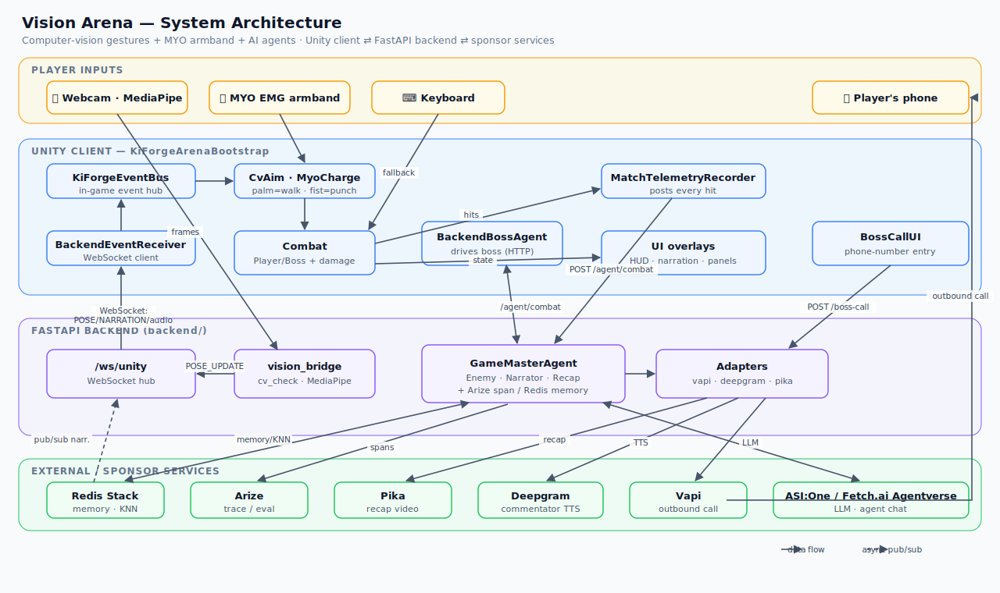
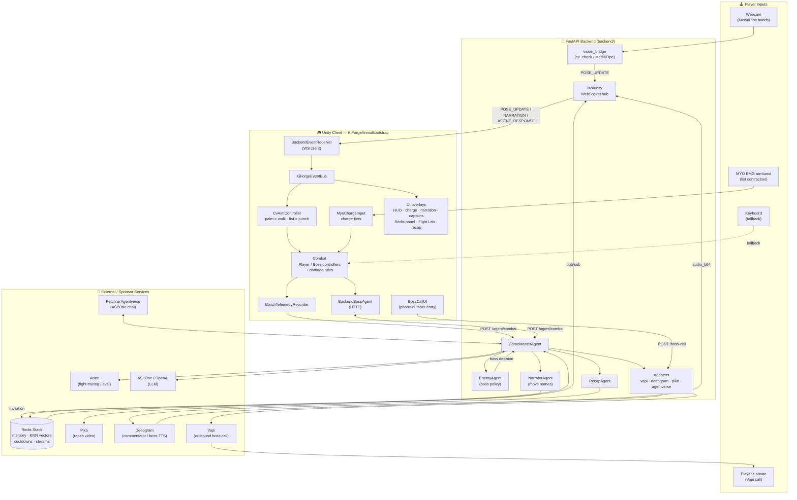

# Vision Arena — Architecture

Vision Arena is a real-time 2.5D boss fight where **computer-vision hand gestures**,
a **MYO EMG armband**, and a swarm of **AI agents** drive the gameplay. It is split
into two processes that talk over a WebSocket (real-time event stream) and plain
HTTP (request/response):

- **Unity client** — the game itself. A single `KiForgeArenaBootstrap` MonoBehaviour
  builds the entire arena at runtime (fighters, combat rules, UI overlays, input,
  and the boss AI link).
- **FastAPI backend** (`backend/`) — the agent brain and sponsor-integration hub.
  A `GameMasterAgent` orchestrates the enemy, narrator, and recap agents and fans
  out to external services (Redis, Arize, Pika, Deepgram, Vapi, ASI:One/Fetch.ai).

Every external dependency has a **mock/fallback seam**, so the local fight is fully
playable with zero API keys; live services are layered on progressively.

## System diagram

Text (Mermaid) version of the diagram

## Data flows

### 1. Vision / input → movement & punches
1. `cv_check` (MediaPipe) reads the webcam; `vision_bridge` normalizes frames into
   `POSE_UPDATE` events.
2. The backend `/ws/unity` hub broadcasts those to every connected Unity client.
3. `BackendEventReceiver` republishes them on the in-game `KiForgeEventBus`.
4. `CvAimController` maps **open palm → walk forward** and **closed fist → punch**;
   `MyoChargeInput` turns longer fist contractions into heavier punch tiers.
5. If CV/MYO frames stop arriving, the keyboard controllers take over automatically.

### 2. Combat hit → adaptive boss
1. On every landed hit, `MatchTelemetryRecorder` posts a `CombatTelemetry` event to
   `POST /agent/combat`.
2. `GameMasterAgent` records an **Arize** span, updates **Redis** player memory, and
   asks `EnemyAgent` for the next boss action.
3. `BackendBossAgent` (Unity) polls the same endpoint to drive the boss in-engine.
4. The boss's associative memory is a **5-dim style vector**; a Redis **KNN** query
   finds the most similar past player and reuses the strategy that beat them.

### 3. Narration, captions & commentary
- `NarratorAgent` names moves; narration is published on the Redis `arena:narration`
  channel, which a backend pub/sub task forwards over the WebSocket as `NARRATION`.
- Commentary TTS (**Deepgram**) is attached to `AGENT_RESPONSE` as `audio_b64` and
  played by `CommentatorAudioPlayer`.

### 4. Pre-fight boss phone call (Vapi)
- `BossCallUI` collects a phone number → `POST /boss-call` → `vapi_adapter` triggers
  an outbound **Vapi** call where the boss (Anthropic model + ElevenLabs voice via
  `"11labs"`) taunts the player before the match. Requires a real telephony number
  imported into Vapi for reliable delivery.

### 5. Post-fight recap (Pika)
- On KO, `RecapAgent` builds a cinematic prompt from real match highlights and
  submits it to **Pika**; the queued job + resulting video URL surface in the
  recap overlay.

### 6. ASI:One / Agentverse
- `backend/uagents_app.py` registers a Fetch.ai uAgent (Mailbox) exposing the Agent
  Chat Protocol so the boss is demoable from **ASI:One**. `POST /agent/chat` is the
  FastAPI route for the same brain.

## Repository map

| Path | Responsibility |
|---|---|
| `Assets/Scripts/Bootstrap` | `KiForgeArenaBootstrap` — runtime wiring of the whole arena |
| `Assets/Scripts/Input` | CV aim, MYO charge, keyboard fallback, WebSocket sources |
| `Assets/Scripts/Combat` | Punch tiers, health, guard timing, boss agent link, strategy weights |
| `Assets/Scripts/UI` | HUD, charge/health bars, narration, captions, Redis & Fight Lab panels, boss-call, recap |
| `Assets/Scripts/Telemetry` | Match event recorder, Arize-style coach feedback, mock agent client |
| `Assets/Scripts/Effects` `/Scene` `/Animation` | Aura/impact FX, camera, fighter animation |
| `backend/main.py` | FastAPI app: WebSocket hub, demo/agent/boss-call routes, lifespan tasks |
| `backend/agents/` | `GameMasterAgent` + `EnemyAgent` / `NarratorAgent` / `RecapAgent` / `CoachAgent` |
| `backend/vision_bridge.py`, `cv_check.py` | MediaPipe webcam → normalized pose events |
| `backend/redis_store.py`, `player_memory.py` | Redis wrapper + 5-dim style vectors / KNN recall |
| `backend/vapi_adapter.py` | Outbound boss phone call |
| `backend/deepgram_tts.py`, `commentary_adapter.py` | Commentator / boss TTS |
| `backend/pika_recap.py`, `recap_queue.py` | Cinematic recap prompt + Pika submission |
| `backend/fight_tracing.py`, `fight_lab.py` | Arize tracing + local eval / adaptation |
| `backend/uagents_app.py`, `agentverse_adapter.py` | Fetch.ai Agentverse / ASI:One integration |
</content>
